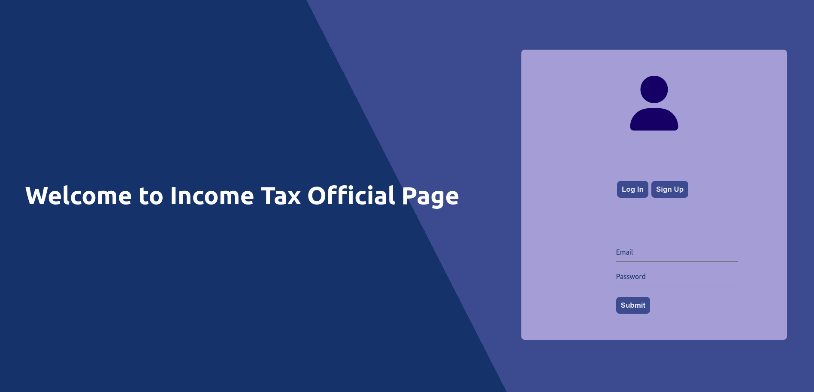

# Income Tax App

This project was bootstrapped with [Create React App](https://github.com/facebook/create-react-app).

## Installation
`npm i` to install dependencies and  `cd ./backend npm i`  to install backend dependencies

## Available Scripts

In the project directory, you can run:

### `npm start`

Runs the app in the development mode.\
Open [http://localhost:3000](http://localhost:3000) to view it in your browser.